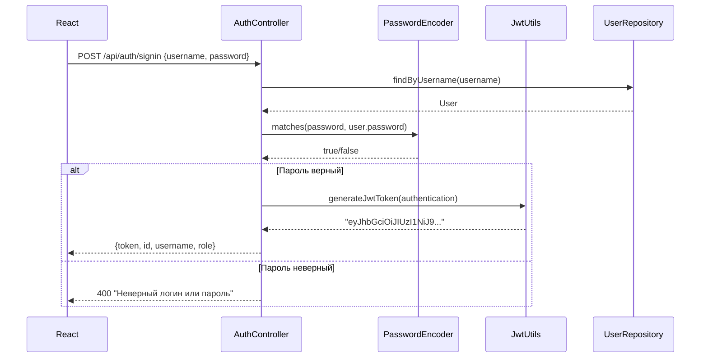
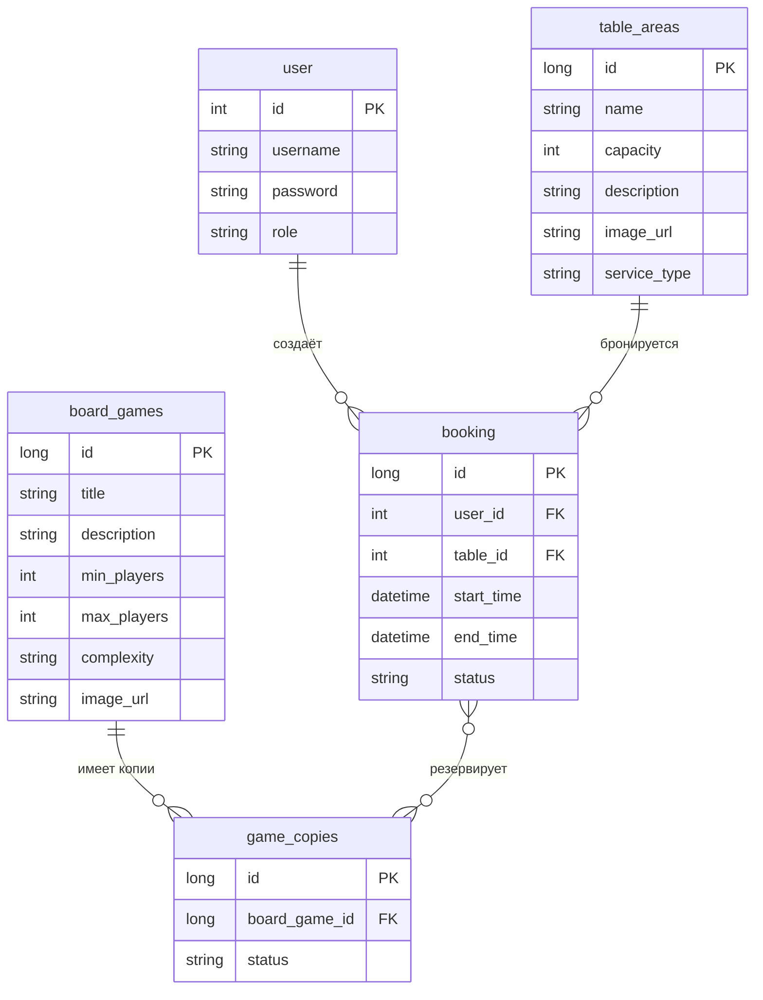

# Документация бэкенда: Антикафе (Spring Boot)

Подробное описание работы бэкенда для веб-приложения бронирования столов и комнат в антикафе.

---

## 1. Что такое Spring Boot?

**Spring Boot** — это фреймворк для создания Java-приложений. Он упрощает настройку: автоматически подключает библиотеки, настраивает базу данных и веб-сервер.

**Основные преимущества:**
- **Автоконфигурация** — минимум настроек вручную
- **Встроенный сервер** — приложение запускается как отдельный сервер (Tomcat)
- **Стартеры** — готовые наборы зависимостей (web, security, jpa и т.д.)

---

## 2. Структура проекта

> **Подробное описание каждого файла** — см. [PROJECT_STRUCTURE.md](../PROJECT_STRUCTURE.md) в корне KursovayaSprReact.

```
user-tasks-backend-main/
├── pom.xml                          # Зависимости Maven
├── src/main/
│   ├── java/ru/isu/taskmanager/
│   │   ├── TaskmanagerApplication.java   # Точка входа
│   │   ├── WebMvcConfig.java              # Настройка раздачи файлов
│   │   ├── controller/                    # REST-контроллеры (API)
│   │   │   ├── AuthController.java
│   │   │   ├── BoardGameController.java
│   │   │   ├── TableAreaController.java
│   │   │   ├── BookingController.java
│   │   │   └── FileUploadController.java
│   │   ├── model/                         # Сущности БД (Entity)
│   │   │   ├── User.java
│   │   │   ├── BoardGame.java
│   │   │   ├── TableArea.java
│   │   │   ├── Booking.java
│   │   │   ├── GameCopy.java
│   │   │   └── ...
│   │   ├── repository/                    # Доступ к БД (JPA)
│   │   │   ├── UserRepository.java
│   │   │   ├── BoardGameRepository.java
│   │   │   └── ...
│   │   ├── security/                      # Безопасность
│   │   │   ├── WebSecurityConfig.java
│   │   │   ├── jwt/                        # JWT-токены
│   │   │   │   ├── AuthTokenFilter.java
│   │   │   │   ├── JwtUtils.java
│   │   │   │   └── AuthEntryPointJwt.java
│   │   │   └── services/
│   │   │       ├── UserDetailsServiceImpl.java
│   │   │       └── UserDetailsImpl.java
│   │   └── payload/                       # DTO для запросов/ответов
│   └── resources/
│       └── application.properties         # Конфигурация
```

---

## 3. Архитектура приложения

```mermaid
flowchart TB
    subgraph Client [Клиент - React]
        Browser[Браузер]
    end

    subgraph SpringBoot [Spring Boot Backend]
        subgraph Controllers [Контроллеры]
            Auth[AuthController]
            BoardGame[BoardGameController]
            GameCopy[GameCopyController]
            TableArea[TableAreaController]
            Booking[BookingController]
            Upload[FileUploadController]
        end

        subgraph Security [Безопасность]
            Filter[AuthTokenFilter]
            JWT[JwtUtils]
        end

        subgraph Services [Сервисы]
            UserDetails[UserDetailsServiceImpl]
        end

        subgraph Repositories [Репозитории]
            UserRepo[UserRepository]
            GameRepo[BoardGameRepository]
            GameCopyRepo[GameCopyRepository]
            TableRepo[TableAreaRepository]
            BookingRepo[BookingRepository]
        end
    end

    subgraph DB [(MySQL)]
        Tables[(Таблицы)]
    end

    Browser -->|HTTP + JWT| Filter
    Filter -->|Проверка токена| JWT
    Filter --> Controllers
    Controllers --> Repositories
    Repositories --> DB
    UserDetails --> UserRepo
```

---

## 4. Поток запроса (как обрабатывается запрос)

```mermaid
sequenceDiagram
    participant C as React (клиент)
    participant F as AuthTokenFilter
    participant J as JwtUtils
    participant Ctrl as Controller
    participant Repo as Repository
    participant DB as MySQL

    C->>F: GET /api/bookings + заголовок Authorization: Bearer &lt;token&gt;
    F->>J: Валидация токена
    alt Токен валидный
        J-->>F: OK, username
        F->>F: Загрузка UserDetails из БД
        F->>F: Установка Authentication в SecurityContext
        F->>Ctrl: Передача запроса
        Ctrl->>Repo: findByUserId(...)
        Repo->>DB: SQL-запрос
        DB-->>Repo: Данные
        Repo-->>Ctrl: Список бронирований
        Ctrl-->>C: JSON-ответ 200
    else Токен истёк или невалидный
        J-->>F: Ошибка
        F-->>C: 401 Unauthorized
    end
```

---

## 5. Аутентификация (JWT)

### Что такое JWT?

**JWT (JSON Web Token)** — это зашифрованная строка, в которой хранятся данные пользователя (логин, срок действия). Сервер выдаёт токен при успешном входе; клиент отправляет его с каждым запросом.

### Как работает вход (логин)



### Как проверяется токен при каждом запросе

1. **AuthTokenFilter** — перехватывает каждый HTTP-запрос
2. Извлекает токен из заголовка `Authorization`
3. **JwtUtils.validateJwtToken()** — проверяет подпись и срок действия
4. Если токен валидный — извлекает `username`, загружает пользователя из БД
5. Устанавливает `Authentication` в `SecurityContext` — Spring «знает», кто сделал запрос
6. Если токен невалидный или истёк — возвращается **401 Unauthorized**

### Файлы, отвечающие за JWT

| Файл | Назначение |
|------|------------|
| `JwtUtils.java` | Генерация и проверка токенов, извлечение username |
| `AuthTokenFilter.java` | Чтение токена из запроса, проверка, установка контекста |
| `AuthEntryPointJwt.java` | Формирование JSON-ответа при 401 |

---

## 6. Роли и доступ (@PreAuthorize)

Некоторые действия разрешены только администраторам:

```java
@PostMapping
@PreAuthorize("hasAuthority('ROLE_ADMIN')")
public BoardGame createBoardGame(@RequestBody BoardGame boardGame) {
    return boardGameRepository.save(boardGame);
}
```

- **ROLE_USER** — обычный пользователь (бронирование, просмотр)
- **ROLE_ADMIN** — администратор (добавление игр, столов, загрузка картинок)

Роль хранится в таблице `user` и передаётся в JWT. При создании `UserDetails` из неё формируются `authorities` для Spring Security.

---

## 7. База данных (JPA / Hibernate)

### Сущности (Entity)

Каждый класс с аннотацией `@Entity` соответствует таблице в MySQL.



### Репозитории (Repository)

Интерфейсы, наследующие `JpaRepository<Entity, Id>`, дают готовые методы для работы с БД:

```java
public interface BoardGameRepository extends JpaRepository<BoardGame, Long> {
    // findAll(), findById(), save(), delete() — уже есть
}

public interface TableAreaRepository extends JpaRepository<TableArea, Long> {
    List<TableArea> findByServiceType(String serviceType);  // кастомный метод
}
```

Spring Data JPA сам генерирует SQL по имени метода: `findByServiceType` → `WHERE service_type = ?`

### DDL (создание таблиц)

В `application.properties`:
```properties
spring.jpa.hibernate.ddl-auto=update
```
- **update** — Hibernate обновляет схему БД при запуске (добавляет новые колонки, не удаляет данные)

---

## 8. REST API (контроллеры)

### Сводка эндпоинтов

| Метод | URL | Описание | Доступ |
|-------|-----|----------|--------|
| POST | `/api/auth/signin` | Вход | Все |
| POST | `/api/auth/signup` | Регистрация | Все |
| GET | `/api/boardgames` | Список игр | Все |
| GET | `/api/boardgames/{id}` | Игра по ID | Все |
| POST | `/api/boardgames` | Добавить игру | Admin |
| PUT | `/api/boardgames/{id}` | Обновить игру | Admin |
| GET | `/api/boardgames/{id}/copies` | Копии игры | Все |
| POST | `/api/boardgames/{id}/copies` | Добавить копию игры | Admin |
| PUT | `/api/boardgames/{id}/copies/{copyId}` | Обновить статус/инв.номер копии | Admin |
| DELETE | `/api/boardgames/{id}/copies/{copyId}` | Удалить копию | Admin |
| GET | `/api/tables` | Список столов (опционально `?type=movie`) | Все |
| POST | `/api/tables` | Добавить стол | Admin |
| PUT | `/api/tables/{id}` | Обновить стол | Admin |
| GET | `/api/bookings` | Мои бронирования | Авторизован |
| POST | `/api/bookings` | Создать бронь | Авторизован |
| POST | `/api/upload` | Загрузить картинку | Admin |
| GET | `/uploads/{filename}` | Получить картинку | Все |

### Пример контроллера

```java
@RestController
@RequestMapping("/api/boardgames")
public class BoardGameController {

    @Autowired
    private BoardGameRepository boardGameRepository;

    @GetMapping
    public List<BoardGame> getAllBoardGames() {
        return boardGameRepository.findAll();
    }

    @PostMapping
    @PreAuthorize("hasAuthority('ROLE_ADMIN')")
    public BoardGame createBoardGame(@RequestBody BoardGame boardGame) {
        return boardGameRepository.save(boardGame);
    }
}
```

- `@RestController` — класс обрабатывает HTTP-запросы, возвращает JSON
- `@GetMapping` / `@PostMapping` — привязка к методу и URL
- `@RequestBody` — тело запроса (JSON) преобразуется в объект Java
- `@PreAuthorize` — проверка прав перед выполнением метода

---

## 9. Загрузка файлов

**FileUploadController** принимает `multipart/form-data`:

1. Проверяет, что файл — изображение (jpg, png, gif, webp)
2. Генерирует уникальное имя (UUID + расширение)
3. Сохраняет в папку `uploads/`
4. Возвращает `{ "filename": "uuid.jpg" }`

**WebMvcConfig** настраивает раздачу файлов:
- Запрос `GET /uploads/имя_файла` → файл из папки `uploads/`

---

## 10. Конфигурация (application.properties)

| Параметр | Значение | Описание |
|----------|----------|----------|
| `spring.datasource.url` | `jdbc:mysql://localhost:3306/boardgames` | Подключение к MySQL |
| `spring.jpa.hibernate.ddl-auto` | `update` | Автообновление схемы БД |
| `taskmanager.app.jwtSecret` | Секретная строка | Ключ для подписи JWT |
| `taskmanager.app.jwtExpirationMs` | 3600000 | Время жизни токена (1 час) |
| `file.upload.directory` | uploads | Папка для загруженных файлов |
| `spring.servlet.multipart.max-file-size` | 10MB | Макс. размер файла |

---

## 11. Зависимости (pom.xml)

| Зависимость | Назначение |
|-------------|------------|
| spring-boot-starter-web | REST API, встроенный Tomcat |
| spring-boot-starter-security | Аутентификация, авторизация |
| spring-boot-starter-data-jpa | Работа с БД через JPA/Hibernate |
| mysql-connector-j | Драйвер MySQL |
| jjwt-api, jjwt-impl | Работа с JWT |
| lombok | Упрощение кода (геттеры, сеттеры) |

---

## 12. Краткие ответы на типичные вопросы преподавателя

**Что такое Spring Boot?**  
Фреймворк для создания Java-приложений с минимумом настроек. Включает веб-сервер, безопасность и работу с БД.

**Как работает аутентификация?**  
При входе сервер выдаёт JWT. Клиент отправляет его в заголовке `Authorization: Bearer <token>`. Фильтр `AuthTokenFilter` проверяет токен и устанавливает пользователя в контекст Spring Security.

**Что такое JPA?**  
Java Persistence API — способ работы с БД через объекты. Классы-сущности маппятся на таблицы, репозитории дают методы `findAll()`, `save()` и т.д.

**Как разграничивается доступ?**  
Через `@PreAuthorize("hasAuthority('ROLE_ADMIN')")` — метод выполняется только если у пользователя есть роль ROLE_ADMIN.

**Где хранятся пароли?**  
В БД в зашифрованном виде (BCrypt). При проверке используется `PasswordEncoder.matches()`.

**Как добавляются новые таблицы?**  
Создаётся класс с `@Entity`, репозиторий `extends JpaRepository`. При `ddl-auto=update` Hibernate создаёт/обновляет таблицы при запуске.
